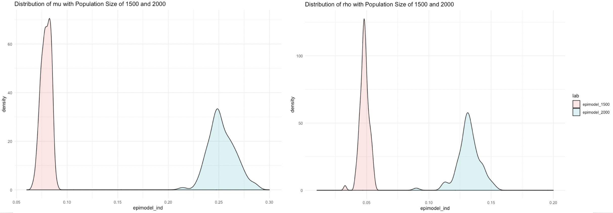
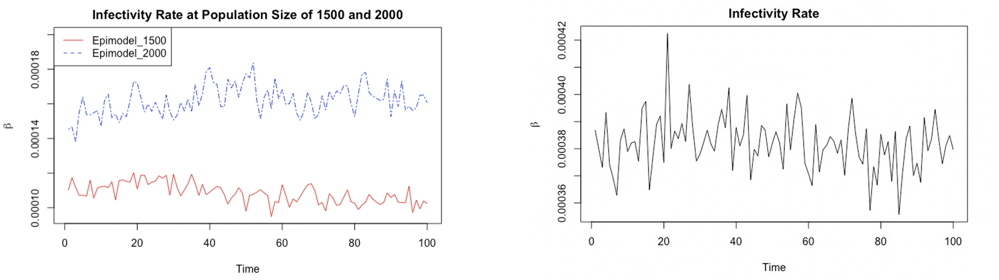
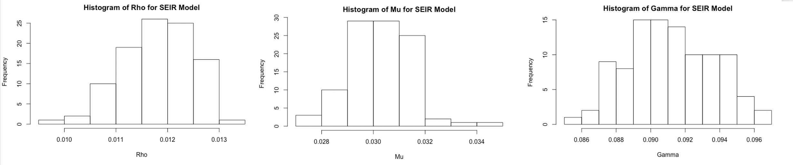

```{r setup, include=FALSE}
knitr::opts_chunk$set(echo = TRUE)
```
```{r results="hide", include=FALSE}
# Import data
require(coronaModel)
require(MLmetrics)
library(reticulate)
data.infected <- read.csv("time_series_covid19_confirmed_global.csv", sep=",", header = TRUE)
data.infected <- data.infected[data.infected[,"Country.Region"]=="Italy",]
infected <- colSums(data.infected[,5:ncol(data.infected)])

data.recovered <- read.csv("time_series_covid19_recovered_global.csv", sep=",", header = TRUE)
data.recovered<- data.recovered[data.recovered[,"Country.Region"]=="Italy",]
recovered <- colSums(data.recovered[,5:ncol(data.recovered)])

data.death <- read.csv("time_series_covid19_deaths_global.csv", sep=",", header = TRUE)
data.death <- data.death[data.death[,"Country.Region"]=="Italy",]
death <- colSums(data.death[,5:ncol(data.death)])

removed <- recovered + death

# Assume a fixed population of 60.36 million in Italy
N <- 60360000
init_b = 0.25
init_g = 1/16
lower_g = 0.06
upper_g = 0.07
upper_b = 0.3
min_init_I = 20
max_init_R = 0

ii = 1
while (infected[ii] < min_init_I && removed[ii] <= max_init_R) {
  ii = ii + 1
}
infected = infected[ii:length(infected)]
death = death[ii:length(death)]
recovered = recovered[ii:length(recovered)]
removed = removed[ii:length(removed)]
```
# Abstract
Coronavirus disease 2019 (COVID-19) is a respiratory illness that can spread from person to
person. The novel coronavirus was first identified during an investigation into an outbreak in
Wuhan, China (CDC, 2020). Up to March 12, there were 125,260 confirmed cases worldwide and 80,981 confirmed cases in China (WHO, 2020). Given the severity of this epidemic, it is crucial to estimate the theoretical number of people infected with COVID-19 over time. At first glance, we apply the deterministic SIR model to predict the progression of this virus.  Although this compartmental model provides a basis to predict the progression of such an epidemic, it excludes the exposed individuals and fails to distinguish the recovered and fatal individuals. Moreover, it assumes that the parameters are fixed. To cope with these issues, we then introduce the modified SEIRD model, which includes more compartments and makes two of its parameters adjustable. We then include stochastic SIR and SEIR models to reveal the discrete transitions among states. The model implemented is an agent based decision analysis Markov chain Monte Carlo framework to generate subject-level infectious history, which is more robust to the missing infectious count data. 

# 1. Introduction
The basic SIR model was first used by Kermack and McKendrick in 1927. In this model, we simply divide the population into three compartments: $S$ (susceptible), $I$ (infectious), $R$ (removed) with probabilities of state changes denoted by $\beta$ (effective contact rate) and $\gamma$ (removal rate).  Therefore, the ordinary differential equation (ODE) describing the dynamics of SIR model has the following deterministic form:

$$
\begin{aligned}
 \frac{dS}{dt} &= -\beta\frac{S(t)I(t)}{N}  \\
 \frac{dI}{dt} &= \beta\frac{S(t)I(t)}{N} - \gamma I(t)  \\
 \frac{dR}{dt} &= \gamma I(t)
\end{aligned}
$$


where  $S(t) + I(t) + R(t) = N$  is the constant total population size (IDM, 2020).

Although this model provides the basis for studying and tracking an epidemic, it deploys some problematic assumptions for simplicity such as constant transmissibility and removal rate over the epidemic period and a well-mixed population that any infected individual has the same probability of contacting any susceptible individual that is reasonably well approximated by the average (Jones, 2007). Moreover, it excludes the asymptomatic infected cases and fails to distinguish the recovered and dead individuals. Last but not least, when the $R_0$(reproductive number) is greater than 1 where $R_0 = \frac{\beta}{\gamma}$, the model converges to an endemic equilibrium that violates our assumption that the disease will eventually disappear (Allen & Burgin, 1999). \bigskip


Building on the basic SIR model and the classic SEIR model (See Appendix A), our modified SEIRD model takes $E$ (exposed individuals) into consideration. However, unlike the classic SEIR model defines exposed individuals as the infected individuals but not yet infectious, we define exposed individuals as individuals with COVID-19 who are asymptomatic. This modification allows the model to address the fact that individuals with no symptoms could still spread COVID-19 during $E$ and estimate their removed compartment into recovered compartment $R$ and dead compartment $D$ by replacing the removal rate by the $\sigma$ (recovery rate) and the $\gamma$ (death rate). In this model, $\alpha_1$ denotes the infectious rate of $S$ infected by $E$, $\alpha_2$ denotes the infectious rate of $S$ infected by $I$ and beta denotes the transmission rate from exposed to infected
$$
\begin{aligned}
 \frac{dS}{dt} &= \alpha_1 * E(t) - \alpha_2 * I(t) \\
 \frac{dE}{dt} &= \alpha_1 * E(t) + \alpha_2 * I(t) - \beta * E(t) \\
 \frac{dI}{dt} &= \beta * E(t) - \sigma * I(t) - \gamma * I(t) \\
 \frac{dD}{dt} &= \gamma * I(t) \\
 \frac{dD}{dt} &= \sigma * I(t) \\
\end{aligned}
$$

Stochastic epidemic models (SEM), on the other hand, allows for more dynamic and realistic assumptions. For example, it assumes the transition from one compartment to another is discrete, whereas the SIR and SEIR models described above are discrete. The stochastic SIR model implemented in this report is robust to the partial observability of infected data. However, the parameters of stochastic SIR model, such as per-contact infectivity rate and recovery rate, are more difficult to estimate. In 2017, Fintzi et al. proposed an agent-based decision analysis Markov chain Monte Carlo (MCMC) framework for fitting SEMs time-series count data. This agent-based model completes the subject-level infection history, through an MCMC that targets the joint posterior distribution of the latent epidemic process and model parameters. Conditionally on the historical disease data of one individual and rates given by other individuals, the model proposes a subject-path for each individual by a time-inhomogeneous continuous-time Markov chain. Compared to other previous models, this model is more robust to missing data and allows for more efficient purtations to the latent epidemic paths (Fintzi, 2017). 

# 2. Methodology
## 2.1 Deterministic SIR Model
Let $Y_i=(S(t_i),I(t_i),R(t_i)$ denote the random variables for the number of susceptible, infectious, and removed individuals at time ti, respectively. Then we use the following method to estimate the deterministic SIR parameter denoted by $\theta = (\beta, \gamma)$:

1. Since only countable infectious and removed data is available from our dataset, we generate $Y_i$ that follows a Poisson distribution $Y_i \sim ~Poi(I_{t_i})$. 

2. Then the log-likelihood estimator for $\theta$ is:
$$log(L(\theta)) = \sum_{all \; i} Y_i log(I(t_i)) - I_{t_i} + const \tag*{(Höhle, 2015)}$$
3. Obtain the initial $\hat{\theta}$. However, the initial value of $\hat{\theta}$ might not lie in the boundaries that we set for $\beta(\gamma<\beta<cap)$ and $\gamma(floor<\gamma<cap)$ respectively. If $\beta \le \gamma$, the infection number decreases monotonically to zero as $R_0 \le1$, which is not the case in reality as COVID-19 results in an outbreak. Also, if $\gamma$is too small, the infected individuals will be hospitalized for too long against the average recovery period is around two to three weeks, and the whole population will be infected which is unrealistic. Hence, the function optim will be rerun until outputting a satisfactory $\hat{\theta}$.

Then we can make use of R package: **deSolve** and its function **ode** to solve for the state variables $S$, $I$ and $R$ each day over the observation period through taking initial state, time sequence at which the simulated output is required, corresponding ODE and $hat_{\theta}$ obtained by the above process as inputs. 

## 2.2 Modified SEIRD Model
Let $Y_i=(S(t_i), E(t_i),I(t_i), R(t_i), D(t_i)$ denote the random variables for the number of susceptible, exposed, infectious, recovered and dead individuals at time $t_i$, respectively. Then we use **seird_m_fit** function in R package: **coronaModel** to fit the modified SEIRD model on $I_i$, $R_i$ and $D_i$. The best parameters $\alpha_1$, $alpha_2$, $\beta$, $\sigma$ and$\gamma$ are found by the following two steps:

1. Since it is not feasible to obtain the actual $E_0$, we make an assumption for $E_0$ based on the corresponding $I_{14}$. In general, some symptoms may take 14 days to appear. This is the longest known incubation period for COVID-19 (Lauer et al., 2020). Therefore, we first set a range for $E_0$ with a lower bound of 0 and an upper bound equals $I_{14}$, and then generate a set of $E_0$ from the given range with a customized increment each time. The increment is solely for saving runtime, as $I_{14}$ could be quite large for some countries.
2. We then input each $E_0$ together with the real dataset to generate parameters $\alpha_1$, $\alpha_2$, $\beta$, $\sigma$ and $\gamma$. We also assign a function to $\alpha_1$ and $\alpha_1$ respectively to improve the flexibility of the model. The set of parameters that has the minimum log loss between the real data and the predicted data, or the maximum average R score will be returned.

## 2.3 Stochastic SIR and SEIR model Model

Data augmentation (BDA) in the context of fitting a stochastic SIR and SEIR models to binomially distributed prevalence. We assume the detected cases follow a binomial distribution, where $Y={Y_1,..., Y_L}$ denotes the disease prevalence counts recorded at times $t_1,...,t	_L\in[t_1,t_L]$. Since the infectious numbers are often partially observable, we assume the possibility of observing a true prevalence at each observation time as $Y_l|I_{t_l} \sim Binomial (I_{t_l},)$. We then propose  $X(\tau)={X_1(\tau),..., X_N(\tau)}$, where $X(\tau)$ is a configuration of the realized subject-path in one of S, I, R state at time. Let be the infectivity parameter, be the recovery rate, be the sampling probability and $p_{t_1}$be the probability of a patient is in state S, I or R at the beginning. We then have the complete data likelihood

$$L(X, Y | \theta) = Pr(Y|X, \rho) \times Pr(X(t_1)|p_{t_1}) \times \pi(X|X(t_1), \beta, \mu)$$

### 2.3.1 The Subject-Path Proposal Framework
Since the observed data likelihood in the posterior $\pi(\theta|Y) 	\propto \pi(Y|\theta)\pi(\theta)$ is intractable, we used data augmentation methods to introduce the subject-paths, $X$, as latent variables in the model, where the joint posterior distribution is 

$$\pi(\theta,X|Y) \propto Pr(Y|X(t_1), \rho) \times Pr(Y|X(t_1),\beta,\mu) \times Pr(Y|X(t_1)|p_{t_1}) \times \pi(\beta)\pi(\mu)\pi(p_{t_1}). $$
  
  
The $\pi(\beta)$, $\pi(\mu)$, $\pi(\rho)$ and $\pi(p_{t_1})$ are prior densities. 

We define the following parameters, $x_{(-j)} = \{x_1, ..., x_{j-1}, x_{j+1}, x_N\}$ that represents the disease subject-path conditional on the data and rates conditioned on the collection of disease histories of the other individuals. $\tau_{(-j)} = \{\tau /\ \tau^{(j)} \} = \{\tau_0^{(-j)}, \tau_1^{(-j)},...,\tau_M^{(-j)},\tau_{M+1}^{(-j)} \}$ represents other subjects become infected or recover. The interval of of $[\tau_i^{(-j)}, \tau_{i+1}^{(-j)})$ is denoted as $I_i$, and $I_t^{(-j)} = \sum_{i \neq j} \mathbb{I}(X_i(\tau) = I)$ be the prevalence at tiem $\tau$ excluding subject j. Let $\Lambda_{(-j)} = \{ \Lambda_0^{(-j)},  \Lambda_1^{(-j)},...,\Lambda_M^{(-j)}, \Lambda_{M+1}^{(-j)}\}$ be the transition matrices

$$\Lambda_m^{(-j)}(\theta) = \begin{pmatrix}-\beta I_{\tau_m}^{(-j)} & \beta I_{\tau_m}^{(-j)} & 0\\
0 & -\mu & \mu \\
0 & 0 & 0
\end{pmatrix}$$

The the transtition probability matrix for subject j over $I_m$ is

$$P^{(j)}(\tau_{m-1}, \tau_m) = (P_{a,b}^{(j)}(\tau_{m-1}, \tau_m))_{a,b \in S_j} = exp[(\tau_m-\tau_{m-1})\Lambda_m^{(-j)}(\theta)] $$
and the time-inhomogeneous CTMC density over the observation period is 

$$\pi(X_j|\Lambda^{(-j)};I) = Pr(X_j(t_1)|p_{t_1}) \times \prod_{m=1}^{M} \pi(X_j|x_j(\tau_{m-1}),\Lambda_m^{(-j)}(\theta);I_m) .$$
  
Similarly, the transition probability matrix over an interval can be written as the product of transition probability matrices over the subintervals in $I_l$, within which the subject-level CTMC is time-homogenous. Thus, the transition probability matrix over an interobservation interval is constructed as 


$$P^{(j)}(t_{l-1}, t_l) =  \prod_{s=1}^{S} P^{(j)}(\tau_{l,s-1}^{(-j)},\tau_{l,s}^{(-j)}). $$
  
The MCMC algorithm for constructing a subject-path proposal proceeds in three steps.
- The hidden Markov model step: sample the disease state of the subject under consideration at the observation times, conditional on the data and disease histoires of other subjects.
- Discrete time skeleton step: sample the state at times when the time-inhomogeneous CTMC rates change, conditional on the sates sampled in the HMM step.
- Event time step: sample the exact times of transition events conditional on the sequence of states sampled in the previous step.

### 2.3.2 The Hidden Markov Model Step 

In this step, we sample the disease state of a subject from observation times, contional on the data and disease histories. Rewriting the probability of the infectious people got tested

$$Y_l|X_j(t_l), I_{t_l}^{(-j)}, \rho \sim  Binomial(\mathbb{I} (X_j(t_l)=I ) +I_{t_l}^{(-j)} ,\rho)$$
  
This emission probability will depend on only the subject $j$ is infected at time $t_l$, since we assume the parameters and other subjects are fixed. as the current state only depends on the previous state, a hidden Markov model is used to model the distribution of $X$ and $Y$. We sample the discrete path of $X_j$ from $(X_j|Y, x_{(-j)}, \theta, ; t_1,...,t_L)$ using a stochastic forward-backward algorithm.

### 2.3.2 The Discrete Time Skeleton Step 
In this step, we first sample the state when the time-inhomogeneous CTMC changes its rate and then sample the full path within each interevent interval. Consider an inter-observation interval, $I_t =[t_{l-1}, t_l]$, containing interevent intervals whose endpoints are given by times $t_{l-1}=\tau_{l,0}^{(-j)}<\tau_{l,1}^{(-j)}<... <\tau_{l,n-1}^{(-j)}<\tau_{l,n}^{(-j)} \equiv t_l$ . Let $\tau =\tau_{l,1}^{(-j)}$ and $x_i=x_j(\tau_{l,1}^{(-j)})$, sample $X_j$ at each intermediate event time, beginning at $\tau_1$, from the discrete distribution with masses.


$$Pr(X_j(\widetilde{\tau_i}) = x_i | X_j(\widetilde{\tau}_{i-1} = x_{i-1}, X_j(\widetilde{\tau}_n) = x_n)) \
= \frac{[P^{(j)}(\widetilde{\tau}_{i-1}, \widetilde{\tau}_i)]_{x_{i-1}, x_i}[\prod_{k=1}^{n-1} P^{(j)}(\widetilde{\tau}_k, \widetilde{\tau}_{k+1})]_{x_i, x_n}}{[\prod_{k=1}^{n-1}P^{(j)}(\widetilde{\tau}_k, \widetilde{\tau}_{k+1})]_{x_{i-1}, x_n}}$$
  
### 2.3.3 Event Time Step
During this final step, we will sample the exact infection and recovery times, by building a subject path from the sequence of states from the previous two steps. When fitting the SIR model, we choose to use a variation of modified Gillespie’s direct algorithm rejection sampling to avoid sampling constant paths. The stochastic SEIR model uses a uniformization-based sampling for a more robust sampling of paths in intervals with multiple transitions.


### 2.3.4 Metropolis-Hasting Step
After building a subject-path proposal, we then use Metropolis-Hasting to accept or reject the subject-path proposal. Since the distribution of the real $X_j|x_{(-j)}$,is not tractable or Markovian, we use the distribution of $\pi(X|Y) \propto \pi(Y|X)\pi(Y)$. We accept a proposed subject-path with probability

$$a_{x^{curr} \to x^{new}}=min\{ \frac{\pi (x^{new})\pi (x_j^{curr})|\Lambda^{(-j)};I)} {\pi(x^{cur})(x_j^{new}|\Lambda{(-j)};I)}, 1\}$$

### Initialization the Collection of Subject-path
The initialization of the subject-paths starts with using the modified Gillespie’s direct algorithm to simulate paths and iterates the algorithm until we have found one probable collection with nonzero probability. We updates the model paramters from each MCMC iteration, which updates subject-path and parameters consecutively. The model updates both of the parameters and subject-path because only updating subject-path or parameters will cause high auto-correlation. We then use Gibbs sampling to draw new parameter values from their univariate full conditional distributions (Fintzi, 2017).

# 3. Results
## 3.1 Deterministic SIR model
In the following discussion, we will base on a real dataset that consists of the infectious and removed individuals’ numbers in Italy from February 21 to April 9 published from John Hopkins University, and a simulated dataset generated by the deterministic SIR model. We carefully choose the initial parameter $\beta$ = 0.25 since $\beta$ = $\tau$(transmissibility)$\bar{c}$(average contact rate), where $\tau$ is assume to be 0.8 given contact between an infectious and susceptible individual and $\bar{c}$ is assumed to be 0.3125 given the intense quarantine and social distancing measures taken in place. $\gamma$ is chosen to be 1/16 since the average recovery period is from three to four weeks and the time from symptom onset to death ranges from two to three weeks(WHO, 2020). Then we apply the previous methodology with these two values as initial inputs to compute $\hat{\theta}$. The optimal parameters are then used to compute the projected $S$, $I$ and $R$ over the observation period. \bigskip

In general, the Deterministic SIR model works well when 1) the contagious disease can end within a short period of time where birth and death can be reasonably omitted 2) the removed rate and transmissibility are constant over time assuming that there is no escalated quarantine measures nor improved medication treatments 3) infected individuals will become infectious right away and have the same probability of contacting any susceptible individual. However, this model has several significant drawbacks. First, the model simply divides the population into three groups, therefore excludes the asymptomatic cases and fails to separate the recovered with dead individuals in the R compartment. Second, the parameter estimation requires initial inputs which might introduce initial error that can impact the parameter optimization. In addition, the basic model generates fixed parameters over the epidemic development. This is unrealistic in the COVID-19 case since contributing factors such as government intervention, protection measures, medical resources and medication treatment change over time. Moreover, $R_0$ must be greater than 1 in order for the model to generate an outbreak; however, in this case the model will converge to an endemic equilibrium such that a portion of the population remains susceptible.

```{r include=TRUE, echo=FALSE, fig.width=10, fig.height=5}
set.seed(2721)
init_I = infected[1]
init_R = removed[1]

# Output the optimal parameters beta and gamma respectively
opt_param <- sir_mle_param(init_b, init_g, lower_g, upper_g, upper_b, infected) # init beta, init gamma, lower_g, upper_g, upper_b

# Calculate the R0 number
R0.hat <- opt_param[1]/opt_param[2]

# Use ode to find the predictions for the SIR model
pred_ode <- sir_ode_fit(opt_param, c(1:length(infected)), N, N-init_I-init_R, init_I, init_R) # remove hardcode later TBD..

# Use iterations to find the predictions for the SIR model
pred <- sir_fit(length(infected), opt_param[1], opt_param[2], N - init_I, init_I, init_R, N)

data <- list(I=infected,R=removed)
loss_sir <- MSE(y_pred=pred$I, y_true=data$I)
par(mfrow=c(1,2))
sir_plot(pred, pred_ode, data)
```

                                               Figure 1
                                               
The lower bound and upper bound of $\gamma$ equal to 0.06 and 0.07 respectively. We also set the upper bound of $\beta$ = 0.3. Figure 1 shows results where the estimated $\beta$ and $\gamma$ are 0.2705 and 0.0666 respectively. $R_0 = 4.06 > 1$ for this iteration, thus the deterministic SIR model predicts an outbreak, which did happen in Italy.  

## 3.2 Modified SEIRD Model
For the modified SEIRD model, we choose the number of infectious individuals on Feb 21 as $I_0$ where $I_0=20$. And then we generate a set of $E_0$ from a range of 0 to 3,858 with an increment of 200. There is no need to input initial values for any parameters. 

There are several improvements it makes on the deterministic SIR model. First, it adds the exposed compartment which allows it to work well even when the infectious disease has an incubation period. Moreover, it divides the removal rate into recovery rate and the fatal rate by adding the dead compartment, which allows us to better understand the severity of the virus. Second, the model uses a machine learning approach which does not require any initial parameter values to get started, thus it is able to reduce the initial error. Third, instead of having all parameters fixed, the model allows us to manipulate the trend of infection rate when there is additional information available. It is quite useful in the COVID-19 case, since the government intervention and quarantine do gradually lower the infection rate.

In general, the modified SEIRD model works well, mainly because of the way this model is set up and the decision criteria we used to determine the best parameters. However, given that there is no real data for $E_0$ and how $E_0$ is determined, it is possible that the model does not choose the most realistic $E_0$, but the $E_0$ with parameters that could best fit the data. Also, it is worth pointing out that there are five parameters in total and one for each compartment, compared to only two parameters in the SIR model. Although the introduction of new parameters gives more flexibility to the model, it may let the model memorize the training data instead of learning the actual relationship (Koehrsen, 2018), especially when the decision criteria is the minimum log loss or the maximum average R score. Therefore, the major drawback of the modified SEIRD model is overfitting. The other drawback of this model is that it could not figure out how the infection rate will change by itself during the epidemic period. Although we could assign a function to the infection rate to make it adjustable, it would be difficult for us to derive and justify the function, except for some intuitive cases like the Italy example. It fits China’s data poorly, since the change in infection rate, recovery rate or death rate are not monotonic. When the outbreak first took place in China, the infection rate rose significantly for a period of time, as people have not taken actions to protect themselves from getting the virus. But then the infection rate started to drop, as people were in quarantine. Obviously, it is hard for us to derive a function that describes the change in infection rate by hand.

```{r include=TRUE, echo=FALSE, fig.width=10, fig.height=5}
os <- import("os")
# use_python("/usr/local/bin/python3.7")
# py_install("scipy")
source_python('seir_main.py')
res <- search_param(30000000, 1200, 25, infected, death, recovered) #init S, range of init E, step, confirmed data, death data, recovered data
param <- res[1][[1]]
E <- res[2][[1]]
I <- infected[1]
D <- death[1]
C <- recovered[1]
a1 = param$alpha1
a2 = param$alpha2
b = param$beta
s = param$sigma
g = param$gamma

pred <- seird_m_fit(49,a1,a2,b,s,g,E, I, D, C, a1_dec_rate = 0.998, a2_dec_rate = 0.998)
data <- list(I=infected, D=death, C=recovered)
loss_seird <- MSE(y_pred = pred$I, y_true = data$I)
par(mfrow=c(1,3))
seird_m_plot(pred, data)
```

                                             Figure 2
                                             
In figure 2,  $\alpha_1$ = 0.8536, $\alpha_2$ = 0, $\beta$ = 0.7035, $\sigma$ = 0.0170 and $\gamma$ = 0.01288, where we assume that both $\alpha_1$ and $\alpha_2$ decline by $0.02\%$ each day. The infection rate of the infectious individual is zero, which makes it an interesting case. This result implies that the susceptible individuals are only infected by the exposed individuals. An possible explanation would be that the exposed individuals get proper treatment once they have symptoms, so they do not infect others when they become infectious.\bigskip

Given Italy's population of 60,360,000, the mean squared error (MSE) of the deterministic SIR model and the modified SEIRD model are 1,846,190,536 and 704,207,089 respectively. As a result, the modified SEIRD model has a better fit as its MSE is smaller.

## 3.3 Stochastic SIR Model
We fit the data from [Waterloo region](https://www.regionofwaterloo.ca/en/health-and-wellness/positive-cases-in-waterloo-region.aspx). The first case observed is on Februrary 20th, and we collected 43 dyas of data point. \newline

The initial state probability parameters are sampled through Dirichlet-Multinomial conjugate distributions for Stochastic SIR model, then we set values for the following parameters.
- `obstimes`: Vector of observation times at which prevalence is sampled. We leave it empty before fitting.

- `popsize`: Total population, ie. N in other models. We use 1500 and 2000 relatively for our models.

- `states`: Categorical vector for the states. We use ```c("S", "I", "R")``` for the SIR model and ```c("S", "E", "I", "R")``` for the SEIR model.

- `params`: Named numeric vector of model parameters. The parameters include the values for per-contact infectivity, recovery rate, and binomial sampling probability for SIR model and one extra parameter gamma for SEIR model. The parameters also include the intial values for each compartments, which are denoted as S0, I0, E0, and R0. One example is $\beta=0.00016$, $\mu=0.26$, $\rho=0.09$, $popsize=1500$ 
  
- `rates`:  Vector of strings that state how to compute the *unlumped* rates for each type of transition. See the supplement of Fintzi, Wakefield, and Minin (2016) for a discussion of the distinction between lumped and unlumped rates. We use ```c("beta * I", "mu")```

- `flow`: This parameter is a numeric matrix represents the movement of individuals in each compartment, where the column corresponds to the compartments in the `states` and the rows correspond to the transition events in `rates`. We use 
- `meas_vars`: Character vector of the observed model compartment. We use "I" for this case. 

- `r_meas_process, d_meas_process`: The functions for sampling from and evaluating the log-density of the measurement process. We use the sampling function and the density function for binomial distribution and rho being the sampling probability.


To fit the model, we use the `fit_model` function to estimate the SEM parameters. During the actual practice, it's not always easy to find the best parameter, so we wrote an utility function that checks if the difference of the parameter we passed in and the average of `n` iterations of the model is less than a threshold.


### 3.3.1 SIR Model on Population Size of 1500 and 2000


We also conducted experiments on SIR model with the population size of 2000 and 1500, which gives us the following density distribution of  $\hat{\beta}$, $\hat{\mu}$ and $\hat{\rho}$. It's quite clear that the model does not estimate similar parameters, which does not match the claim in the paper that given different population size, the posterior inferences about the epidemic dynamics are not substantially affected. The estimated parameters under 2000 population size can relatively accruate for the full population size (Fintzi, 2017).

In the following experiment, we used the population size of 2000 and initial values of $\beta=0.00016$, $\mu=0.26$, $\rho=0.09$ and obtained estimated parameters of $\hat{\beta}=0.00015$, $\hat{\mu}=0.256$ and $\hat{\rho}=0.118$ and obtained $0.00015$,$0.186$ and $0.205$. When we set the population size of 1500, the parameters we obtained are $\hat{\beta}=0.00016$, $\hat{\mu}=0.254$, and $\hat{\rho}=0.133$ 





### 3.3.2 SEIR Model on Population Size of 2000
In the following experiment, we used the population size of 2000 and initial values of $\beta=0.00040$,$\gamma=0.10$, $\mu=0.03$, $\rho=0.01$ and obtained estimated parameters of $\hat{\beta}=0.00038$, $\gamma=0.091$, $\hat{\mu}=0.030$ and $\hat{\rho}=0.118$





We'd also like to note the SIR and SEIR seem to focus on different aspect of the infected people. The mean squared error for SEIR is 23.83 and the mean squared error for SIR is 36.87. The SEIR model has a better fit for earlier data, but it also indicates there will be a significant boost of the infected people around the 40th day; however, this situation did not happen in the real case, possibly because of the effective quanrantine order in place. The SIR model on the other hand, the parameter $\rho$ - the ratio of the people who are infected and also tested - seems to have a stronger influence on the simulation result at the early stage, but the case count plateaus in the long run. Judging by the data provided by Region of Waterloo, the number of infected people seems to fit the stochastic SIR model better.

# 4. Discussion
Coming back to these three compartmental models respectively, first, the basic SIR model lays down a foundation for studying how COVID-19 evolves. It relies on the assumptions that the population is well-mixed and closed and individual characteristics of transmissibility and ability to recover are the same for all population. This model has a lot of room for improvement as it first oversimplifies the problem by only dividing the population into three groups in terms of two fixed parameters that are supposed to change due to externalities over time. Second, the initial inputs required for parameter estimation might bring in initial error that can affect the latter MLE. Moreover, this model does not converge to an disease-free equilibrium when R0is greater than 1. \bigskip

By including more compartments and additional adjustable parameters, the modified SEIRD model is more suitable for realistic cases, compared to the deterministic SIR model.  By using a machine learning approach, it does not require any initial values for parameters which minimizes the initial error. This model works well not only for Italy, but also for the majority of the countries. However, we still need to work on addressing the issue of overfitting. To resolve this, more data from the same country will be needed, which is not feasible in our case. On the other hand, what we can do is to let the model itself derive the changing functions for different parameters, which can digest and reflect more information. \bigskip

The drawbacks of the models are also clear. Note that the total population in the model is set to 2000, which is far less than 601220, the real population of Waterloo Region. This is because when calculating the transition probability matrix (TPM), $P(t)$ for a homogeneous CTMC over an interval of length t, we need to solve a matrix differential equation. 

$$\frac{d}{dt}P(t) = \Lambda P(t), \ s.t. P(0) = I$$ 

The $P = exp(t\Lambda)$ is the most intensive step in the algorithm, since it will calcuate $P$ for every partitioned time intervals. The research paper implemented a method to cache the result eigenvalues and eigenvectors, as the exponetialization of a matrix will be applied to the same rate matrix. Also, the method in this paper solves the problem that with absent data on the progression of the virus, the complicated latent variable can cause the state size to grow large when the population increases, by updating the subject-level paths. Since we have to track the all the subject-paths, the overall runtime will be negatively influenced by the computational overhead. The paper also states the MCMC algorithm is coded for reliability and MCMC mixing can be too slow in a large population for practical use. 

One other drawback is we cannot find a set of suitable parameters with completely randomly generated parameters, we have to start with an educated guess or empirical results which will at least give a non-zero probability after the initialization step.
\newpage

# 5. Appendices

## Appendix A SEIR Model

$S$ is the fraction of susceptible individuals (those able to contract the disease),
$E$ is the fraction of exposed individuals (those who have been infected but are not yet infectious),
$I$ is the fraction of infective individuals (those capable of transmitting the disease),
$R$ is the fraction of recovered individuals (those who have become immune).

Furthermore, suppose that
There are equal birth and death rates $\mu$,
$1/\alpha$ is the mean latent period for the disease,
$1/\gamma$ is the mean infectious period,
recovered individuals are permanently immune,
the contact rate $\beta$ may be a function of time.

$$ \frac{dS}{dt} = \mu - \beta(t) S I - \mu S $$
 $$\frac{dE}{dt} = \beta(t) S I - (\mu + \alpha) E $$
 $$\frac{dI}{dt} = \alpha E - (\mu + \gamma) I \tag*{(Joan \& Ira, 1984)}$$

The variable $R$ is determined from the other variables according to equation $S+E+I+R = 1$. When $\beta = \beta_0 = {\rm constant}$, this is a three-dimensional autonomous system of ordinary differential equations. Defining

$$
\begin{aligned}
R_0 &= \frac{\beta_0 \alpha}{(\mu + \alpha) (\mu + \gamma)}
\end{aligned}
$$

it can be shown that for $R_0>1$ the model has a fixed point with $I=0$ which is unstable, and a fixed point with $I>0$ which is stable, etc. 

## Appendix B Waterloo region data

```{r echo=FALSE, include=TRUE}
start_date = as.Date("2020-02-27")
dates = c(start_date)
for (i in 1:42){
  dates = c(dates,start_date+i )
}

waterloo_cases = c(0,1,3,0,1,0,0,1,2,2,1,3,8,5,8,6,8,7,8,11,
                   8,14,6,7,6,6,10,8,9,4,2,9,4,14,8,8,10,11,
                   12,11,21,8,2)
times = 0:(length(waterloo_cases)-1)
waterloo_df = data.frame(waterloo_cases, dates)
waterloo_sampled <- as.matrix(data.frame( time=times, I=waterloo_cases))
barplot(waterloo_cases, xlab="Date", names.arg=dates)
```

## Appendix C Codes

### Import data
```{r echo=TRUE, eval=FALSE}

require(coronaModel)
require(MLmetrics)
library(reticulate)
# Data sourced from Johns Hopkins dataset.
data.infected <- read.csv("time_series_covid19_confirmed_global.csv", sep=",", header = TRUE)
data.infected <- data.infected[data.infected[,"Country.Region"]=="Italy",]
infected <- colSums(data.infected[,5:ncol(data.infected)])

data.recovered <- read.csv("time_series_covid19_recovered_global.csv", sep=",", header = TRUE)
data.recovered<- data.recovered[data.recovered[,"Country.Region"]=="Italy",]
recovered <- colSums(data.recovered[,5:ncol(data.recovered)])

data.death <- read.csv("time_series_covid19_deaths_global.csv", sep=",", header = TRUE)
data.death <- data.death[data.death[,"Country.Region"]=="Italy",]
death <- colSums(data.death[,5:ncol(data.death)])

removed <- recovered + death

# Assume a fixed population of 60.36 million in Italy
N <- 60360000
init_b = 0.25
init_g = 1/16
lower_g = 0.06
upper_g = 0.07
upper_b = 0.3
min_init_I = 20
max_init_R = 0

ii = 1
while (infected[ii] < min_init_I && removed[ii] <= max_init_R) {
  ii = ii + 1
}
infected = infected[ii:length(infected)]
death = death[ii:length(death)]
recovered = recovered[ii:length(recovered)]
removed = removed[ii:length(removed)]
```

### SIR Model

```{r eval=FALSE, echo=TRUE}
set.seed(2721)
init_I = infected[1]
init_R = removed[1]

# Output the optimal parameters beta and gamma respectively
opt_param <- sir_mle_param(init_b, init_g, lower_g, upper_g, upper_b, infected) # init beta, init gamma, lower_g, upper_g, upper_b

# Calculate the R0 number
R0.hat <- opt_param[1]/opt_param[2]

# Use ode to find the predictions for the SIR model
pred_ode <- sir_ode_fit(opt_param, c(1:length(infected)), N, N-init_I-init_R, init_I, init_R) # remove hardcode later TBD..

# Use iterations to find the predictions for the SIR model
pred <- sir_fit(length(infected), opt_param[1], opt_param[2], N - init_I, init_I, init_R, N)

data <- list(I=infected,R=removed)
loss_sir <- MSE(y_pred=pred$I, y_true=data$I)
par(mfrow=c(1,2))
sir_plot(pred, pred_ode, data)
```

### SEIRD Modified Model

```{r eval=FALSE, echo=TRUE}
os <- import("os")
# use_python("/usr/local/bin/python3.7")
# py_install("scipy")
source_python('seir_main.py')
res <- search_param(30000000, 1200, 25, infected, death, recovered) #init S, range of init E, step, confirmed data, death data, recovered data
param <- res[1][[1]]
E <- res[2][[1]]
I <- infected[1]
D <- death[1]
C <- recovered[1]
a1 = param$alpha1
a2 = param$alpha2
b = param$beta
s = param$sigma
g = param$gamma

pred <- seird_m_fit(49,a1,a2,b,s,g,E, I, D, C, a1_dec_rate = 0.998, a2_dec_rate = 0.998)
data <- list(I=infected, D=death, C=recovered)
loss_seird <- MSE(y_pred = pred$I, y_true = data$I)
par(mfrow=c(1,3))
seird_m_plot(pred, data)

####### Python codes #########
import numpy as np
from scipy.optimize import dual_annealing, minimize
from collections import namedtuple

SEIR_PARAM = namedtuple('SEIRparm', ['alpha1', 'alpha2', 'beta', 'sigma', 'gamma'])

class SEIR(object):

	def __init__(self, P=None):

		self.P = P
	# Each iteration to find the next set of parameters with modified SEIR model.
	def forward(self, S, E, I, D, C, param, max_iter):
		a1, a2, b, s, g = param
		est = []
		for t in range(max_iter):
			S_ = S - a1 * E - a2 * I + s * I
			E_ = E + a1 * E + a2 * I - b * E
			I_ = I + b * E - s * I - g * I
			D_ = D + g * I
			C_ = C + s * I
			S, E, I, D, C = S_, E_, I_, D_, C_
			est.append([S, E, I, D, C])
		return est

	# Metric function that computes the log loss of real data and predicted data.
	def logloss(self, obs, est):
		assert len(obs) == len(est)
		loss = ((np.log2(obs + 1) - np.log2(est + 1)) ** 2).sum()
		self.lossing.append(loss)
		return loss

	# Metric function that computes the r2 score of real data and predicted data.
	def r2_score(self, y_true, y_pred):
		y_true = np.asarray(y_true)
		y_pred = np.asarray(y_pred)
		numerator = ((y_true - y_pred) ** 2).sum(axis=0,
														  dtype=np.float64)
		denominator = ((y_true - np.average(
			y_true, axis=0, weights=None)) ** 2).sum(axis=0,
															  dtype=np.float64)
		return 1 - numerator / denominator

	# Helper function that returns a list of data as a form of [confirmed, death, recovered]
	# Input: data  -  a list of three lists containing confirmed data, death data and recovered data in each list.
	def get_IDC(self, data):
		res = []
		for i in range(len(data)):
			res.append([data[i][2], data[i][3], data[i][4]])
		return res

	# Optimized function that uses log loss to fit the model
	def opt_fn(self, param, s, e, i, d, c, obs):
		est = self.forward(s, e, i, d, c, param, len(obs))
		return self.logloss(obs, np.asarray(self.get_IDC(est)))

	# Fit the input data and find the best parameters with optimized function defined above
	def fit(self, initS, initE, initI, initD, initC, Y):
		self.lossing = []
		args = (initS, initE, initI, initD, initC, np.asarray(Y))
		param = [(0, 1), ] * 5
		result = dual_annealing(self.opt_fn, param, args=args, seed=30, maxiter=10)['x']
		self.P = SEIR_PARAM(*result)

	# Convert rows data to three-column data (confirmed, death, recovered)
	def get_column_data(self, rows):
		col1 = []
		col2 = []
		col3 = []
		for i in range(len(rows)):
			col1.append(rows[i][0])
			col2.append(rows[i][1])
			col3.append(rows[i][2])
		return col1, col2, col3

	# Computer log loss and average r2 score
	def score(self, initS, initE, initI, initD, initC, Y):
		est = self.get_IDC(self.predict(initS, initE, initI, initD, initC, len(Y)))
		loss = self.logloss(np.asarray(Y), np.asarray(est))

		y1, y2, y3 = self.get_column_data(Y)
		est1, est2, est3 = self.get_column_data(est)
		r1 = self.r2_score(y1, est1)
		r2 = self.r2_score(y2, est2)
		r3 = self.r2_score(y3, est3)

		return loss, (r1 + r2 + r3) / 3

	# Make predictions for T days with initial values
	def predict(self, initS, initE, initI, initD, initC, T):
		return self.forward(initS, initE, initI, initD, initC, self.P, T)

# Convert training data as column form
def get_train_data(confirmed_data, death_data, recovered_data):
	train = []
	for i in range(len(confirmed_data)):
		train.append([confirmed_data[i], death_data[i], recovered_data[i]])
	return train

# Main function that finds the best params (alpha1, alpha2, beta, sigma, gamma) and optimal initial E
def search_param(init_S, init_E, step, confirmed, death, recovered):
	seir = SEIR()
	train = get_train_data(confirmed, death, recovered)
	min_loss, max_r2, best_param, likeli_potential = float('inf'), float('-inf'), None, 0
	for potential in range(0, int(init_E), int(step)):
		seir.fit(int(init_S), potential, train[0][0], train[0][1], train[0][2], train)
		loss, r2 = seir.score(int(init_S), potential, train[0][0], train[0][1],  train[0][2], Y=train)
		if loss < min_loss and r2 > max_r2:
			min_loss, max_r2, best_param, likeli_potential = loss, r2, seir.P, potential
	seir.P = best_param
	return best_param, likeli_potential
	
################ Python Test ###################	

from seir_main import SEIR 
import unittest
import numpy as np
from sklearn.metrics import r2_score

# This is the unit test file to test the function in SEIR class.
# Run: `python3 -m unittest test_sier_main.py` to run the tests.
class TestSeir(unittest.TestCase):

	def test_forward(self):
		self.seir = SEIR()
		S = 10000
		E = 10
		I = 100
		D = 50
		C = 100
		param = [0.1,0.2,0.3,0.4,0.5]
		iteration = 50
		result = self.seir.forward(S,E,I,D,C,param,iteration)
		self.assertEqual(len(result[0]), 5)
		self.assertEqual(len(result), iteration)

	def test_log_loss(self):
		self.seir = SEIR()
		y_pred = np.asarray([[1,2,3,4], [1,2,3,4],[2,2,3,4]])
		y_true = np.asarray([[1,2,3,4], [1,3,2,4],[2,3,4,4]])
		result = self.seir.logloss(y_true, y_pred)
		self.assertEqual(round(result,6), 0.6204060)

	def test_r2_score(self):
		self.seir = SEIR()
		y_pred = [[1,2,3,4], [1,2,3,4],[1,1]]
		y_true = [[1,2,3,4], [1,3,2,4], [2,1]]
		for i in range(len(y_pred)):
			result = self.seir.r2_score(y_true[i], y_pred[i])
			self.assertEqual(result, r2_score(y_true[i], y_pred[i]))

	def test_get_column_data(self):
		self.seir = SEIR()
		rows = [[1,2,3], [1,2,3],[2,2,3],[4,5,6],[66,66,44]]
		result = self.seir.get_column_data(rows)
		self.assertEqual(len(result[0]), len(rows))
		self.assertEqual(len(result), len(rows[0]))

	def test_score(self):
		self.seir = SEIR()
		self.seir.P = (0.1,0.2,0.3,0.4,0.5)
		S = 10000
		E = 10
		I = 100
		D = 50
		C = 100
		Y = [[1,2,3], [1,2,3],[66,66,44]]
		result = self.seir.score(S,E,I,D,C,Y)
		self.assertEqual(len(result), 2)

```

### Stochastic SIR Model

```{r eval=FALSE}

require(ggplot2)
require(Rcpp)
require(MCMCpack)
require(BDAepimodel)
require(coronaModel)
set.seed(58267)

initial_params_1500 <- list(beta=0.00016, mu=0.26, rho=0.09)
epimodel_1500 <- best_parmas_finder(initial_params_1500, 
                                    dat=waterloo_sampled,
                                    thres=4e-6, pop_size=1500)

epimodel_1500$params
plot_latent_posterior(epimodel_1500, 
                      states = "I", times = epimodel_1500$obstimes, cm = "mn")


set.seed(58267)
initial_params_2000 <- list(beta=0.00016, mu=0.26, rho=0.09)
epimodel_2000 <- best_parmas_finder(initial_params_2000, 
                                    dat=waterloo_sampled,
                                    thres=4e-6, pop_size=2000)

epimodel_2000$params
plot_latent_posterior(epimodel_2000, 
                      states = "I", times = epimodel_2000$obstimes, cm = "mn")


apply(epimodel_1500$results$params, 2, get_avg)

apply(epimodel_2000$results$params, 2, get_avg)


ts.plot(epimodel_1500$results$params[,"beta"],
        ylab = expression(beta), 
        main="Infectivity Rate at Population Size of 1500 and 2000",
        col="red", ylim=c(0.000095, 0.00020))
lines(epimodel_2000$results$params[,"beta"],
      ylab = expression(beta), 
      main="Infectivity Rate at Population Size of 1500 and 2000",
      col="blue", lty=6)
legend("topleft", legend=c("Epimodel_1500", "Epimodel_2000"),
       col=c("red", "blue"), lty=1:6)


epimodel_1500_mu = data.frame(epimodel_ind = epimodel_1500$results$params[,"mu"])
epimodel_2000_mu = data.frame(epimodel_ind = epimodel_2000$results$params[,"mu"])
epimodel_1500_mu$lab = "epimodel_1500"
epimodel_2000_mu$lab = "epimodel_2000"
mu_plots <- rbind(epimodel_1500_mu, epimodel_2000_mu )
p1 <- ggplot(mu_plots, aes(epimodel_ind, fill = lab)) + 
        geom_density(alpha = 0.2) + 
        xlim(0.06, 0.30) +
        ggtitle("Distribution of mu with Population Size of 1500 and 2000")
p1 + theme_minimal()

epimodel_1500_rho = data.frame(epimodel_ind = epimodel_1500$results$params[,"rho"])
epimodel_2000_rho = data.frame(epimodel_ind = epimodel_2000$results$params[,"rho"])
epimodel_1500_rho$lab = "epimodel_1500"
epimodel_2000_rho$lab = "epimodel_2000"
rho_plots <- rbind(epimodel_1500_rho, epimodel_2000_rho )
p2 <- ggplot(rho_plots, aes(epimodel_ind, fill = lab)) +
          geom_density(alpha = 0.2) +
          xlim(0.01, 0.2) +
          ggtitle("Distribution of rho with Population Size of 1500 and 2000")
p2 + theme_minimal()


grid.arrange(p1, p2, ncol=2)


initial_params <- list(beta=0.00040, gamma=0.10, mu=0.03, 
                       rho=0.010, popsize=2000)
epimodel <- best_parmas_finder(initial_params,
                               dat=waterloo_sampled, SEIR=TRUE,
                               thres=1e-5, pop_size=2000)
plot_latent_posterior(epimodel_1500, 
                      states = "I", times = epimodel_1500$obstimes, cm = "mn")

apply(epimodel$results$params,2, get_avg)

epimodel_gamma  = data.frame(epimodel_param= epimodel$results$params[,"gamma"])
epimodel_mu = data.frame(epimodel_param = epimodel$results$params[,"mu"])
epimodel_rho = data.frame(epimodel_param = epimodel$results$params[,"rho"])
hist(epimodel_gamma$epimodel_param, main="Histogram of Gamma for SEIR Model", xlab="Gamma")
hist(epimodel_mu$epimodel_param, main="Histogram of Mu for SEIR Model", xlab="Mu")
hist(epimodel_rho$epimodel_param, main="Histogram of Rho for SEIR Model", xlab="Rho")

set.seed(2001)
simulation_plot(epimodel_2000, orig_data = waterloo_sampled)
simulation_plot(epimodel, orig_data = waterloo_sampled, SEIR=TRUE )
```

\newpage

# 6. References

Allen, L. (1999, August 25). Comparison of deterministic and stochastic SIS and SIR models in discrete time [PDF File]. Lubbock: Texas Tech University.\newline \newline

Aron, Joan & Schwartz, Ira. (1984). Seasonality and period-doubling bifurcations in an epidemic model. Journal of theoretical biology. 110. 665-79. 10.1016/S0022-5193(84)80150-2.\newline \newline

Centers of Disease Control and Prevention (n.d.). Coronavirus disease 2019 (COVID-19) and you. Retrieved April 17, 2020 from https://www.cdc.gov/coronavirus/2019-ncov/downloads/2019-ncov-factsheet.pdf\newline \newline

Höhle, M. (2015, November). Temporal and Spatio-Temporal Modelling and Monitoring of Infectious Diseases [PDF File]. Stockholm, Sweden: Stockholm University.\newline \newline
IDM. (n.d.). SIR and SIRS models. Retrieved April 17, 2020, from https://idmod.org/docs/general/model-sir.html \newline \newline

Jonathan Fintzi, Xiang Cui, Jon Wakefield & Vladimir N. Minin (2017) Efficient Data Augmentation for Fitting Stochastic Epidemic Models to Prevalence Data, Journal of Computational and Graphical Statistics, 26:4, 918-929, DOI: 10.1080/10618600.2017.1328365 \newline \newline

Jones, J. (2007, May 1). Notes On R0 [PDF File](p. 2). Stanford, California: Stanford University. Retrieved April 17, 2020 from https://web.stanford.edu/~jhj1/teachingdocs/Jones-on-R0.pdf \newline \newline

Koehrsen, W. (2018, January 28). Overfitting vs. Underfitting: A Complete Example. Retrieved from https://towardsdatascience.com/overfitting-vs-underfitting-a-complete-example-d05dd7e19765 \newline \newline

Lauer, S. A., Grantz, K. H., Bi, Q., Jones, F. K., Zheng, Q., Meredith, H. R., … Lessler, J. (2020, March 10). The Incubation Period of Coronavirus Disease 2019 (COVID-19) From Publicly Reported Confirmed Cases: Estimation and Application. Retrieved from https://annals.org/aim/fullarticle/2762808/incubation-period-coronavirus-disease-2019-covid-19-from-publicly-reported \newline \newline

Moulds, J. (2020, March 23). People with mild or no symptoms could be spreading COVID-19. Retrieved from https://www.weforum.org/agenda/2020/03/people-with-mild-or-no-symptoms-could-be-spreading-covid-19/ \newline \newline

World Health Organization (2020, February). Report of the WHO-China Joint Mission on Coronavirus Disease 2019 (COVID-19). Retrieved April 17, 2020 from https://www.who.int/docs/default-source/coronaviruse/who-china-joint-mission-on-covid-19-final-report.pdf \newline \newline

World Health Organization (2020, March 12). Coronavirus disease 2019 (COVID-19) Situation Report – 52. Retrieved April 17, 2020 from https://www.who.int/docs/default-source/coronaviruse/20200312-sitrep-52-covid-19.pdf?sfvrsn=e2bfc9c0_2

